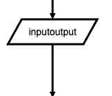

[](http://js.org)

# [flowchart.js](http://flowchart.js.org)

flowchart.js is a flowchart DSL and SVG render that runs in the browser and [terminal](https://github.com/francoislaberge/diagrams/#flowchart).

Nodes and connections are defined separately so that nodes can be reused and connections can be quickly changed.
Fine grain changes to node and connection style can also be made right in the DSL.

## Example

```flowchart
st=>start: Start:>http://www.google.com[blank]
e=>end:>http://www.google.com
op1=>operation: My Operation
sub1=>subroutine: My Subroutine
cond=>condition: Yes
or No?:>http://www.google.com
io=>inputoutput: catch something...
para=>parallel: parallel tasks

st->op1->cond
cond(yes)->io->e
cond(no)->para
para(path1, bottom)->sub1(right)->op1
para(path2, top)->op1
```


## CLI
See [francoislaberge/diagrams](https://github.com/francoislaberge/diagrams/#flowchart) on how to flowchart.js in the terminal.

## Browser Usage

flowchart.js is on [CDNJS](https://cdnjs.com/libraries/flowchart), feel free to use it.

You will also need [Raphaël](http://www.raphaeljs.com/), which is also on [CDNJS](https://cdnjs.cloudflare.com/ajax/libs/raphael/2.3.0/raphael.min.js).

The demo html page is at [example/index.html](example/index.html).

## Node Syntax
`nodeName=>nodeType: nodeText[|flowstate][:>urlLink]`

Items in `[]` are optional.

_nodeName_ defines the nodes variable name within the flowchart document.

_nodeType_ defines what type the node is. See **Node Types** for more information.

_nodeText_ is the text that will be inserted into the node. Newlines are allowed and will be reflected in the rendered node text.

_flowstate_ is optional and uses the `|` operator that specifies extra styling for the node.

_urlLink_ is optional and uses the `:>` operator to specify the url to link to.

## Node Types
Defines the shape that the node will take.

### start
Used as the first node where flows start from.
Default text is `Start`.


```flowchart
st=>start: start
```

### end
Used as the last node where a flow ends.
Default text is `End`.


```flowchart
e=>end: end
```

### operation
Indicates that an operation needs to happen in the flow.


```flowchart
op1=>operation: operation
```

### inputoutput
Indicates that IO happens in a flow.



```flowchart
io=>inputoutput: inputoutput
```

### subroutine
Indicates that a subroutine happens in the flow and that there should be another flowchart that documents this subroutine.


```flowchart
sub1=>subroutine: subroutine
```

### condition
Allows for a conditional or logical statement to direct the flow into one of two paths.


```flowchart
cond=>condition: condition
Yes or No?
```

### parallel
Allows for multiple flows to happen simultaneously.


```flowchart
para=>parallel: parallel
```

## Connections
Connections are defined in their own section below the node definitions.
The `->` operator specifies a connection from one node to another like `nodeVar1->nodeVar2->nodeVar3`.

Not all nodes need to be specified in one string and can be separaged like so

```flowchart
nodeVar1->nodeVar2
nodeVar2->nodeVar3
```

Connection syntax is as follows:

`<node variable name>[(<specificaion1>[, <specification2])]-><node variable name>[[(<specificaion1>[, <specification2])]-><node variable name>]`

Items in `[]` are optional.

### Directions
The following directions are availiable and define the direction the connection will leave the node from. If there are more than one specifiers, it is always the last. All nodes have a default direction making this an optional specification. `<direction>` will be used to indicate that one of the below should be used in its place.

* left
* right
* top
* bottom

### Node Specific Specifiers by Type
Each node variables has optional specifiers, like direction, and some have special specifiers depending on the node type that are defined below. Specifiers are added after the variable name in `()` and separated with `,` like `nodeVar(spec1, spec2)`.

### start
Optional direction

`startVar(<dirction>)->nextNode`

### end
No specifications because connections only go to the end node and do not leave from it.

`previousNode->endVar`

### operation
Optional direction

`operationVar(<direction>)->nextNode`

### inputoutput
Optional direction

`inputoutputVar(<direction>)->nextNode`

### subroutine
Optional direction

`subroutineVar(<direction>)->nextNode`

### condition
Required logical specification of `yes` or `no`

Optional direction

```flowchart
conditionalVar(yes, <direction>)->nextNode1
conditionalVar(no,  <direction>)->nextNode2
```

### parallel
Required path specification of `path1`, `path2`, or `path3`

Optional direction

```flowchart
parallelVar(path1, <direction>)->nextNode1
parallelVar(path2, <direction>)->nextNode2
parallelVar(path3, <direction>)->nextNode3
```

## Links
A external link can be added to a node with the `:>` operator.

The `st` node is linked to `http://www.google.com` and will open a new tab because `[blank]` is at the end of the URL.

The `e` node is linked to `http://www.yahoo.com` and will cause the page to navigate to that page instead of opening a new tab.

```flowchart
st=>start: Start:>http://www.google.com[blank]
e=>end: End:>http://www.yahoo.com
```

## Advice
Symbols that should possibly not be used in the text: `=>` and `->` and `:>` and `|` and `@>` and `:$`

If you want to emphasize a specific path in your flowchart, you can additionally define it like this:

```
st@>op1({"stroke":"Red"})@>cond({"stroke":"Red","stroke-width":6,"arrow-end":"classic-wide-long"})@>c2({"stroke":"Red"})@>op2({"stroke":"Red"})@>e({"stroke":"Red"})
```

## Contributors

via [GitHub](https://github.com/adrai/flowchart.js/graphs/contributors)

## Thanks

Many thanks to [js-sequence-diagrams](http://bramp.github.io/js-sequence-diagrams/) which greatly inspired this project, and forms the basis for the syntax.

## Licence

Copyright (c) 2019 Adriano Raiano

Permission is hereby granted, free of charge, to any person obtaining a copy
of this software and associated documentation files (the "Software"), to deal
in the Software without restriction, including without limitation the rights
to use, copy, modify, merge, publish, distribute, sublicense, and/or sell
copies of the Software, and to permit persons to whom the Software is
furnished to do so, subject to the following conditions:

The above copyright notice and this permission notice shall be included in
all copies or substantial portions of the Software.

THE SOFTWARE IS PROVIDED "AS IS", WITHOUT WARRANTY OF ANY KIND, EXPRESS OR
IMPLIED, INCLUDING BUT NOT LIMITED TO THE WARRANTIES OF MERCHANTABILITY,
FITNESS FOR A PARTICULAR PURPOSE AND NONINFRINGEMENT. IN NO EVENT SHALL THE
AUTHORS OR COPYRIGHT HOLDERS BE LIABLE FOR ANY CLAIM, DAMAGES OR OTHER
LIABILITY, WHETHER IN AN ACTION OF CONTRACT, TORT OR OTHERWISE, ARISING FROM,
OUT OF OR IN CONNECTION WITH THE SOFTWARE OR THE USE OR OTHER DEALINGS IN
THE SOFTWARE.
